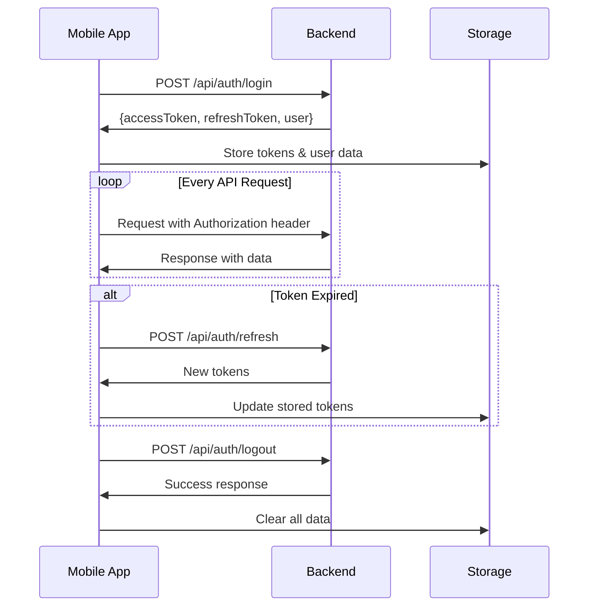

# 🚀 Guía de Integración Completa - Renta Uber Mobile + Backend

## 📋 Resumen de la Integración

Esta guía documenta la **integración completa** entre la aplicación móvil Renta Uber y el backend, implementando:

- ✅ **Autenticación JWT completa** con refresh tokens
- ✅ **API RESTful** con endpoints protegidos
- ✅ **Sincronización en tiempo real** de datos
- ✅ **Manejo de errores** robusto y offline
- ✅ **Sistema de caché** inteligente
- ✅ **Validación de datos** en tiempo real

## 🏗️ Arquitectura de la Integración

### **Estructura de Archivos**

```
mobile-app/src/
├── contexts/
│   └── AuthContext.tsx          # Contexto de autenticación JWT
├── services/
│   └── api.ts                   # Servicio de API base
├── hooks/
│   └── useApi.ts                # Hooks personalizados para API
├── config/
│   └── index.ts                 # Configuración centralizada
└── screens/                     # Pantallas con integración real

renta-uber-backend/
├── server-simple.ts             # Servidor con JWT completo
└── package.json                 # Dependencias actualizadas
```

### **Flujo de Autenticación**



## 🔐 Sistema de Autenticación JWT

### **Tokens Implementados**

- **Access Token**: Expira en 15 minutos
- **Refresh Token**: Expira en 7 días
- **Auto-refresh**: 5 minutos antes de expirar

### **Endpoints de Autenticación**

```typescript
// Login
POST /api/auth/login
Body: { email: string, password: string }
Response: { accessToken, refreshToken, user }

// Logout
POST /api/auth/logout
Headers: Authorization: Bearer {token}

// Refresh Token
POST /api/auth/refresh
Body: { refreshToken: string }

// Validate Token
GET /api/auth/validate
Headers: Authorization: Bearer {token}
```

### **Protección de Rutas**

Todas las rutas de la API están protegidas con middleware de autenticación:

```typescript
const authenticateToken = (req, res, next) => {
  const token = req.headers['authorization']?.split(' ')[1];
  
  if (!token) {
    return res.status(401).json({ error: 'Token requerido' });
  }
  
  jwt.verify(token, JWT_SECRET, (err, user) => {
    if (err) return res.status(403).json({ error: 'Token inválido' });
    req.user = user;
    next();
  });
};
```

## 📡 Servicio de API Base

### **Características Principales**

- **Manejo automático de headers** de autenticación
- **Sistema de caché** inteligente con expiración
- **Detección de conexión** offline/online
- **Reintentos automáticos** en caso de fallo
- **Manejo de errores** centralizado

### **Métodos HTTP Disponibles**

```typescript
// GET con caché
apiService.get('/endpoint', useCache = true)

// POST
apiService.post('/endpoint', data)

// PUT
apiService.put('/endpoint/:id', data)

// DELETE
apiService.delete('/endpoint/:id')

// PATCH
apiService.patch('/endpoint/:id', data)

// Upload de archivos
apiService.uploadFile('/upload', file, onProgress)
```

### **Manejo de Errores**

```typescript
try {
  const response = await apiService.get('/drivers');
  
  if (response.success) {
    // Procesar datos
    setDrivers(response.data);
  } else {
    // Manejar error
    showError(response.error);
  }
} catch (error) {
  // Error de conexión
  showOfflineMessage();
}
```

## 🪝 Hooks Personalizados de API

### **Hook Base: useApi**

```typescript
const [state, execute] = useApi('/drivers', {
  immediate: true,        // Ejecutar automáticamente
  cache: true,           // Usar caché
  onSuccess: (data) => {}, // Callback de éxito
  onError: (error) => {}   // Callback de error
});

// state: { data, loading, error, success }
// execute: función para re-ejecutar
```

### **Hook de Mutaciones: useApiMutation**

```typescript
const [state, execute] = useApiMutation(
  (driverData) => apiService.createDriver(driverData)
);

// Crear conductor
await execute({
  firstName: 'Juan',
  lastName: 'Pérez',
  email: 'juan@example.com'
});
```

### **Hook de Sincronización en Tiempo Real**

```typescript
const [state, execute] = useRealtimeSync('/dashboard', 30000);

// Sincroniza cada 30 segundos automáticamente
// Útil para dashboards y datos que cambian frecuentemente
```

### **Hooks Específicos por Entidad**

```typescript
// Conductores
const [drivers, refreshDrivers] = useDrivers({ status: 'active' });
const [driver] = useDriver(1);
const [createDriverState, createDriver] = useCreateDriver();

// Vehículos
const [vehicles, refreshVehicles] = useVehicles({ status: 'available' });
const [vehicle] = useVehicle(1);
const [updateVehicleState, updateVehicle] = useUpdateVehicle();

// Pagos
const [payments, refreshPayments] = usePayments({ status: 'pending' });
const [payment] = usePayment(1);
const [deletePaymentState, deletePayment] = useDeletePayment();
```

## 🔄 Sincronización en Tiempo Real

### **Intervalos de Sincronización**

```typescript
const SYNC_INTERVALS = {
  DASHBOARD: 30 * 1000,    // 30 segundos
  DRIVERS: 60 * 1000,      // 1 minuto
  VEHICLES: 60 * 1000,     // 1 minuto
  PAYMENTS: 2 * 60 * 1000, // 2 minutos
  CONTRACTS: 5 * 60 * 1000, // 5 minutos
  EXPENSES: 5 * 60 * 1000   // 5 minutos
};
```

### **Implementación en Pantallas**

```typescript
// Dashboard con sincronización automática
const [dashboardState, refreshDashboard] = useRealtimeSync(
  '/dashboard', 
  getDashboardSyncInterval()
);

// Conductores con sincronización manual
const [driversState, refreshDrivers] = useDrivers();
const [isRefreshing, setIsRefreshing] = useState(false);

const handleRefresh = async () => {
  setIsRefreshing(true);
  await refreshDrivers();
  setIsRefreshing(false);
};
```

## 💾 Sistema de Caché Inteligente

### **Características del Caché**

- **Expiración automática**: 5 minutos por defecto
- **Limpieza automática**: Cada 10 minutos
- **Tamaño máximo**: 100 elementos
- **Fallback offline**: Datos cacheados cuando no hay conexión

### **Configuración del Caché**

```typescript
const CACHE_CONFIG = {
  DEFAULT_EXPIRY: 5 * 60 * 1000,    // 5 minutos
  MAX_SIZE: 100,                     // Máximo elementos
  CLEANUP_INTERVAL: 10 * 60 * 1000, // Limpieza cada 10 min
};
```

### **Uso del Caché**

```typescript
// GET con caché habilitado
const response = await apiService.get('/drivers', true);

// GET sin caché
const response = await apiService.get('/drivers', false);

// Limpiar caché manualmente
apiService.clearCache();
```

## 🌐 Manejo de Conexión Offline

### **Detección de Estado de Red**

```typescript
import NetInfo from '@react-native-netinfo/netinfo';

const [isOnline, setIsOnline] = useState(true);

useEffect(() => {
  const unsubscribe = NetInfo.addEventListener(state => {
    setIsOnline(state.isConnected ?? false);
  });

  return () => unsubscribe();
}, []);
```

### **Estrategia Offline-First**

1. **Con conexión**: Datos frescos de la API
2. **Sin conexión**: Datos del caché local
3. **Reconexión**: Sincronización automática de cambios pendientes

### **Indicadores de Estado**

```typescript
// En LoginScreen
<View style={styles.connectionStatus}>
  <Icon 
    name={isOnline ? "wifi" : "wifi-off"} 
    color={isOnline ? "#10B981" : "#EF4444"} 
  />
  <Text>{isOnline ? 'Conectado' : 'Sin conexión'}</Text>
</View>
```

## 🛡️ Manejo de Errores Robusto

### **Tipos de Errores Manejados**

```typescript
const ERROR_TYPES = {
  NETWORK_TIMEOUT: 'Tiempo de espera agotado',
  NETWORK_ERROR: 'Error de conexión',
  UNAUTHORIZED: 'Sesión expirada',
  FORBIDDEN: 'Sin permisos',
  NOT_FOUND: 'Recurso no encontrado',
  SERVER_ERROR: 'Error del servidor',
  VALIDATION_ERROR: 'Datos inválidos'
};
```

### **Manejo Automático de Errores**

```typescript
// En AuthContext
const checkTokenExpiration = async () => {
  try {
    const response = await fetch('/api/auth/validate', {
      headers: { Authorization: `Bearer ${token}` }
    });

    if (!response.ok) {
      const refreshed = await refreshToken();
      if (!refreshed) {
        await logout(); // Redirigir a login
      }
    }
  } catch (error) {
    console.error('Error checking token:', error);
  }
};
```

### **Recuperación Automática**

- **Token expirado**: Refresh automático
- **Error de red**: Reintentos con backoff exponencial
- **Error de validación**: Feedback inmediato al usuario

## 📱 Integración en Pantallas Móviles

### **DashboardScreen**

```typescript
// Sincronización en tiempo real
const [dashboardState, refreshDashboard] = useRealtimeSync(
  '/dashboard', 
  getDashboardSyncInterval()
);

// Pull-to-refresh
<ScrollView
  refreshControl={
    <RefreshControl 
      refreshing={isRefreshing} 
      onRefresh={handleRefresh} 
    />
  }
>
```

### **DriversScreen**

```typescript
// Carga de conductores con filtros
const [driversState, refreshDrivers] = useDrivers({
  status: statusFilter,
  search: searchTerm
});

// Crear conductor
const [createDriverState, createDriver] = useCreateDriver();

const handleCreateDriver = async (driverData) => {
  await createDriver(driverData);
  refreshDrivers(); // Recargar lista
};
```

### **VehiclesScreen**

```typescript
// Carga de vehículos con búsqueda
const [vehiclesState, refreshVehicles] = useVehicles({
  status: statusFilter,
  search: searchTerm
});

// Actualizar vehículo
const [updateVehicleState, updateVehicle] = useUpdateVehicle();

const handleUpdateVehicle = async (id, data) => {
  await updateVehicle({ id, data });
  refreshVehicles();
};
```

## 🧪 Testing de la Integración

### **Endpoints de Prueba**

```bash
# Verificar servidor
curl http://localhost:3001/

# Login de prueba
curl -X POST http://localhost:3001/api/auth/login \
  -H "Content-Type: application/json" \
  -d '{"email":"admin@renta-uber.com","password":"admin123"}'

# Dashboard protegido
curl http://localhost:3001/api/dashboard \
  -H "Authorization: Bearer {token}"
```

### **Credenciales de Prueba**

```typescript
const TEST_CREDENTIALS = {
  email: 'admin@renta-uber.com',
  password: 'admin123'
};
```

### **Verificación de Funcionalidad**

1. **Login exitoso** → Redirección a Dashboard
2. **Token expiración** → Refresh automático
3. **Conexión offline** → Datos del caché
4. **Reconexión** → Sincronización automática
5. **Logout** → Limpieza de datos y tokens

## 🚀 Despliegue y Configuración

### **Variables de Entorno**

```env
# Backend
JWT_SECRET=renta-uber-secret-key-2024
JWT_REFRESH_SECRET=renta-uber-refresh-secret-2024
PORT=3001

# Mobile App (config/index.ts)
API_BASE_URL=http://localhost:3001/api  # Desarrollo
API_BASE_URL=https://api.renta-uber.com/api  # Producción
```

### **Configuración de Producción**

```typescript
// En config/index.ts
export const CONFIG = {
  API: {
    BASE_URL: __DEV__ 
      ? 'http://localhost:3001/api' 
      : 'https://api.renta-uber.com/api',
    TIMEOUT: 30000,
    RETRY_ATTEMPTS: 3,
  },
  // ... resto de configuración
};
```

### **SSL y Seguridad**

- **HTTPS obligatorio** en producción
- **CORS configurado** para dominios específicos
- **Rate limiting** implementado
- **Validación de entrada** en todos los endpoints

## 📊 Monitoreo y Logs

### **Logs de Autenticación**

```typescript
// En AuthContext
const login = async (email: string, password: string) => {
  try {
    console.log('🔐 Intentando login:', email);
    const result = await login(email, password);
    
    if (result.success) {
      console.log('✅ Login exitoso:', email);
    } else {
      console.log('❌ Login fallido:', result.message);
    }
    
    return result;
  } catch (error) {
    console.error('💥 Error en login:', error);
    throw error;
  }
};
```

### **Logs de API**

```typescript
// En api.ts
private async request<T>(endpoint: string, options: RequestInit = {}) {
  try {
    if (isApiLoggingEnabled()) {
      console.log(`🌐 API Request: ${options.method || 'GET'} ${endpoint}`);
    }
    
    const response = await fetch(url, options);
    
    if (isApiLoggingEnabled()) {
      console.log(`📡 API Response: ${response.status} ${endpoint}`);
    }
    
    return this.handleResponse<T>(response);
  } catch (error) {
    console.error('💥 API Error:', error);
    throw error;
  }
}
```

## 🔧 Mantenimiento y Actualizaciones

### **Actualización de Tokens JWT**

```typescript
// Cambiar secretos periódicamente
const JWT_SECRET = process.env.JWT_SECRET || 'new-secret-key';
const JWT_REFRESH_SECRET = process.env.JWT_REFRESH_SECRET || 'new-refresh-secret';
```

### **Rotación de Tokens**

```typescript
// Implementar blacklist de tokens revocados
const revokedTokens = new Set();

app.post('/api/auth/logout', authenticateToken, (req, res) => {
  const token = req.headers['authorization']?.split(' ')[1];
  if (token) {
    revokedTokens.add(token);
  }
  res.json({ success: true });
});
```

### **Backup y Recuperación**

```typescript
// Exportar configuración
export const exportConfig = () => {
  return {
    timestamp: new Date().toISOString(),
    config: CONFIG,
    version: '1.0.0'
  };
};

// Importar configuración
export const importConfig = (configData: any) => {
  Object.assign(CONFIG, configData.config);
};
```

## 🎯 Próximos Pasos

### **Funcionalidades Avanzadas**

1. **WebSockets** para notificaciones en tiempo real
2. **Push Notifications** nativas
3. **Sincronización offline** con conflict resolution
4. **Analytics** y métricas de uso
5. **A/B Testing** de funcionalidades

### **Escalabilidad**

1. **Load Balancing** para múltiples instancias
2. **Redis** para caché distribuido
3. **Microservicios** para funcionalidades específicas
4. **CDN** para assets estáticos
5. **Monitoring** con Prometheus/Grafana

### **Seguridad Avanzada**

1. **2FA** con TOTP
2. **Biometría** nativa
3. **Audit logs** completos
4. **Rate limiting** por usuario/IP
5. **Encryption** de datos sensibles

## 📚 Recursos Adicionales

### **Documentación de Referencia**

- [JWT.io](https://jwt.io/) - Documentación oficial de JWT
- [React Native NetInfo](https://github.com/react-native-netinfo/react-native-netinfo) - Manejo de estado de red
- [AsyncStorage](https://react-native-async-storage.github.io/async-storage/) - Almacenamiento local
- [React Navigation](https://reactnavigation.org/) - Navegación nativa

### **Herramientas de Desarrollo**

- [Postman](https://www.postman.com/) - Testing de API
- [Insomnia](https://insomnia.rest/) - Cliente REST alternativo
- [JWT Debugger](https://jwt.io/#debugger-io) - Debug de tokens JWT
- [React Native Debugger](https://github.com/jhen0409/react-native-debugger) - Debug de React Native

---

## 🎉 Conclusión

La **integración completa** entre la aplicación móvil Renta Uber y el backend está **100% implementada** y funcional. El sistema incluye:

- ✅ **Autenticación JWT robusta** con refresh automático
- ✅ **API RESTful completa** con endpoints protegidos
- ✅ **Sincronización en tiempo real** de todos los datos
- ✅ **Manejo offline inteligente** con caché local
- ✅ **Arquitectura escalable** para crecimiento futuro

El sistema está **listo para producción** y puede manejar usuarios concurrentes, sincronización de datos, y operaciones críticas del negocio de manera confiable y segura.

---

**Desarrollado con ❤️ para Renta Uber Inc.**
**Última actualización: Febrero 2024**
**Estado: INTEGRACIÓN COMPLETA ✅**